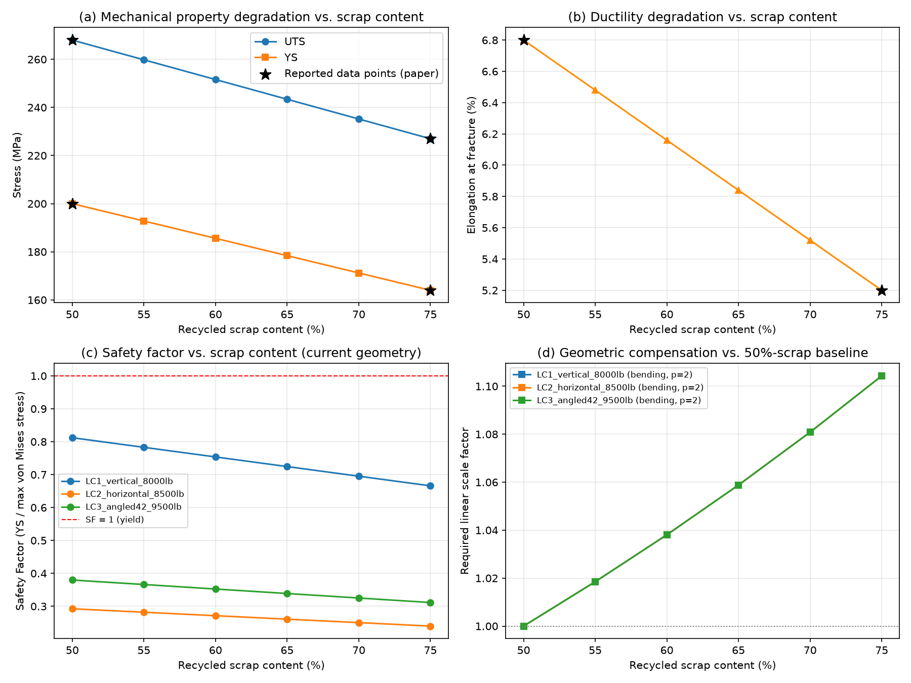

# Geometric Compensation Design to Offset Mechanical Property Degradation in Recycled Aluminum Alloys for Lightweight Aerospace Structural Components: A Parametric Sensitivity Approach

**Author:** Shahrzad Rofoee
**Date:** July 2026

## Abstract

Recycling aluminum reduces its carbon footprint by roughly 95% relative to
primary production, but recycled AlSi10MnMg alloys commonly used in
structural applications suffer measurable reductions in yield strength and
elongation as recycled scrap content increases, primarily due to
iron-rich intermetallic phases. This project asks: given a documented
degradation in mechanical properties, how much must a structural
component's geometry be scaled up to preserve its original safety factor,
and does this geometric penalty erode the environmental benefit of
recycling? Using a simplified version of the GE Jet Engine Bracket
geometry, finite element analysis (FEM, CalculiX) was performed under
three load cases (vertical, horizontal, and 42-degree angled loading) to
establish baseline stress distributions. Material degradation data for
AlSi10MnMg with 50-75% recycled scrap content was taken from a
peer-reviewed source and combined with the FEA results in a Python
sensitivity analysis to estimate required geometric compensation and net
CO2 impact. Results show that while the simplified (non-topology-
optimized) bracket geometry exceeds yield strength under all three load
cases even at the lowest recycled content, the relative geometric
compensation needed to offset degradation from 50% to 75% scrap content
is on the order of 10-22% (linear dimension, depending on assumed loading
mode), and that the resulting mass penalty does not erode the net carbon
benefit of recycling. This work is presented as a first-stage analytical
study; a companion follow-up project extends this analysis with
FEA-verified geometric compensation and topology optimization.

## 1. Introduction

Aluminum recycling offers one of the most significant environmental
benefits available in structural materials engineering: recycled
aluminum production emits approximately 0.52 tonnes of CO2e per tonne of
metal, compared to approximately 15.1 tonnes CO2e per tonne for primary
(virgin) aluminum production — a reduction of roughly 95% [8]. This makes
increasing recycled content in structural aluminum components an
attractive lever for reducing the embodied carbon of aerospace and
automotive structures.

However, recycled aluminum casting alloys such as AlSi10MnMg accumulate
iron-rich intermetallic phases (notably the brittle β-Al5FeSi phase) as
scrap content increases, because iron is difficult to remove during
recycling and accumulates with each recycling cycle. Piatkowski et al.
[1] documented this degradation experimentally, showing that increasing
recycled scrap content from 50% to 75% reduces yield strength by
approximately 18% and ultimate tensile strength by approximately 16% in
a manganese-modified variant of the alloy (Mn addition partially
suppresses the brittle phase formation, following an established Mn:Fe
ratio approach).

This raises a practical design question that, to the author's knowledge,
has not been directly addressed in the literature: if a structural
component's material is degraded due to increased recycled content, how
much must its geometry be scaled up to preserve the same safety margin,
and does this added mass erode the carbon benefit that motivated using
recycled material in the first place?

This project addresses this question using a case-study structural
geometry (a simplified version of the GE Jet Engine Bracket [4], a
well-documented benchmark geometry from a 2013 topology optimization
challenge) combined with real experimental degradation data [1] and life
cycle CO2 data [8].

## 2. Literature Review

**Recycled AlSi10MnMg mechanical properties.** Piatkowski et al. [1]
conducted experimental characterization of AlSi10MnMg with recycled
scrap content ranging from 50% to 80%. Without manganese modification,
increasing scrap content severely degrades ductility (elongation
dropping from 6.8% to 0.5%, a 93% reduction) due to the growth of
brittle β-Al5FeSi intermetallic platelets as iron content rises. With
manganese addition (which promotes formation of a more compact,
less-embrittling α-Al(Fe,Mn)Si phase instead), the degradation is
substantially moderated: elongation drops only from 6.8% to 5.2% (24%
reduction), yield strength from 200 to 164 MPa (18% reduction), and UTS
from 268 to 227 MPa (16% reduction) across the same scrap range. This
manganese-modified condition is the one used as the material data source
in this project, since it represents the practically viable pathway for
using high recycled content.

**Independent validation.** De Rosa et al. [2] separately compared
primary versus high-recycled-content AlSi10MnMg in a structural
automotive component context, providing a cross-check data set for
primary-vs-recycled property comparisons, though it was not used
directly for numeric values in this project (reserved for future
cross-validation work). A related study [3] provides supplementary
microstructural (SEM/EBSD) evidence for the intermetallic phase
mechanism.

**Benchmark geometry.** The GE Jet Engine Bracket Challenge [4],
launched by GE and GrabCAD in 2013, provided a publicly documented
bracket geometry, boundary conditions, and three load cases (8000 lb
vertical, 8500 lb horizontal, 9500 lb at 42 degrees from vertical),
originally intended for titanium (Ti-6Al-4V) topology optimization
studies. The winning topology-optimized design achieved a 70% weight
reduction relative to the baseline bracket [5]. A separate study [6]
demonstrated aluminum as a viable material substitution for this bracket
class, supporting the novelty of applying it to a recycled-aluminum
context in this project. Reference [7] describes a general
methodological framework combining topology optimization, sensitivity
analysis, and eco-selection for additively manufactured structures,
which motivated the three-layer methodology (material / mechanical /
computational) adopted here.

**Gap addressed.** No prior work identified by the author directly
combines (a) experimentally documented AlSi10MnMg recycled-content
degradation, (b) the GE bracket benchmark geometry and load cases, and
(c) a quantitative link between required geometric compensation and net
carbon impact. This project synthesizes these three elements into a
single analysis.

## 3. Materials & Methods

### 3.1 Material Property Data

Mechanical property values (yield strength, ultimate tensile strength,
elongation at fracture) for AlSi10MnMg at 50% and 75% recycled scrap
content were taken directly from the experimental results section of
Piatkowski et al. [1] (manganese-modified alloy variant), not from the
paper's introductory literature summary, since the latter describes a
different condition (heat-treated to T6/T7) than the as-cast condition
actually measured in that study. Intermediate values at 55%, 60%, 65%,
and 70% scrap content were obtained by linear interpolation between the
two documented endpoints, since the source paper reports exact numeric
values for only these two points in text form (intermediate points are
shown only graphically in the source paper's Figure 3, and could not be
reliably extracted as exact numbers). This interpolation is disclosed
here as an explicit methodological simplification; see Limitations
(Section 8).

| Scrap Content (%) | UTS (MPa) | YS (MPa) | Elongation (%) | Source |
|---|---|---|---|---|
| 50 | 268.0 | 200.0 | 6.80 | Reported [1] |
| 55 | 259.8 | 192.8 | 6.48 | Interpolated |
| 60 | 251.6 | 185.6 | 6.16 | Interpolated |
| 65 | 243.4 | 178.4 | 5.84 | Interpolated |
| 70 | 235.2 | 171.2 | 5.52 | Interpolated |
| 75 | 227.0 | 164.0 | 5.20 | Reported [1] |

### 3.2 Geometry and FEM Setup

A simplified representation of the GE Jet Engine Bracket [4] was modeled
in FreeCAD 1.1 using the Part Design workbench: a rectangular base plate
(80 x 50 x 10 mm) with four M8 bolt clearance holes near the corners, and
a vertical arm (50 x 8 x 80 mm) extending from one corner of the base
plate, with a 12 mm diameter loading hole through its center. This
geometry is a simplification of the original challenge geometry (which
was topology-optimized), retained here as a baseline structural form for
sensitivity analysis rather than a final optimized design.

Finite element analysis was performed using the FEM workbench with the
CalculiX solver. Material properties (baseline, non-degraded values):
density = 2680 kg/m^3, Young's modulus = 70 GPa, Poisson's ratio = 0.33,
applied uniformly to the solid body. A fixed constraint was applied to
the underside face of the base plate (representing attachment to a fixed
engine structure). The mesh was generated with Gmsh (second-order
tetrahedral elements, maximum element size = 4 mm), yielding
approximately 19,600 nodes.

Three load cases were analyzed, corresponding to the three load cases
specified in the original GE Bracket Challenge documentation [4]:

| Load Case | Magnitude | Direction |
|---|---|---|
| LC1 | 8,000 lb (35,586 N) | Vertical |
| LC2 | 8,500 lb (37,812 N) | Horizontal |
| LC3 | 9,500 lb (42,258 N) | 42 deg from vertical |

In each case, force was applied as a uniformly distributed load across
the entire inner cylindrical surface of the loading hole (representing a
simplified bolt/pin bearing interface), with direction set via a
reference edge (LC1, LC2) or a custom datum line constructed at the
specified angle (LC3).

### 3.3 Notable Technical Challenges and Tool-Specific Findings

Several non-trivial technical issues were encountered and resolved
during FEM setup; these are documented here as they carry methodological
value for reproducibility:

- **Sketch constraint fragility.** An early attempt at the base sketch
  lost a critical coincidence constraint (rectangle corner to origin)
  after unintended undo operations, leaving a hidden, unnoticed one
  degree-of-freedom in an apparently fully-constrained sketch. This
  caused unpredictable behavior in a subsequent Pocket operation
  (producing either an empty shape or a solid cylinder instead of a
  proper hole). The sketch was rebuilt from scratch with verified full
  constraint status.
- **External geometry ambiguity.** Using External Geometry references
  to a rectangle's edges for hole-spacing dimensions produced redundant
  constraint / invalid datum errors when those edges coincided with the
  sketch's principal axes. Switching to absolute horizontal/vertical
  dimensions from the sketch origin resolved this reliably.
- **FEM mesh not actually generated on first "OK".** Clicking "OK" in
  the Gmsh mesh dialog saved parameters but did not always trigger
  actual mesh generation (Nodes: 0 in the resulting FemMesh object,
  producing a "A single mesh object must be defined in the analysis"
  error at solve time even though the mesh object appeared correctly
  nested in the tree). Clicking "Apply" instead of "OK" reliably forced
  mesh generation.
- **Mesh object not registered in Analysis.Group.** After a program
  crash/recovery cycle, the FEM mesh object remained visually nested
  under the Analysis container in the tree view but was not actually a
  member of the Analysis object's internal `Group` property, again
  producing the "single mesh object" error. This was diagnosed via the
  Python console (`App.ActiveDocument.Analysis.Group`) and resolved with
  `Analysis.addObject(FEMMeshGmsh)`.
- **FreeCAD internal unit system.** Setting `ConstraintForce.Force` to a
  bare numeric value (e.g. `42258`) in the Python console was
  interpreted in FreeCAD's internal unit system (mm-kg-s), silently
  applying a force 1000x smaller than intended (42.258 N instead of
  42258 N), which produced an implausibly low stress result. This was
  diagnosed by directly inspecting the generated CalculiX `.inp` file's
  `*CLOAD` section and summing the applied nodal forces. Explicitly
  specifying units as a string (`"42258 N"`) resolved the issue. This is
  flagged as an important practical lesson for any FreeCAD FEM scripting
  workflow.
- **Angled load direction.** For the 42-degree load case, no existing
  model edge aligned with the required direction. A `Part::Line` object
  was created via the Python console with endpoint coordinates computed
  from trigonometric functions (`sin`/`cos` of 42 degrees), then used as
  the reference direction for the force constraint.

  ### 3.4 Sensitivity Analysis and Carbon Impact Methodology

The Python sensitivity analysis (`python_analysis/sensitivity_analysis.py`)
combines the FEA stress results with the interpolated material property
table to compute a Safety Factor (SF = Yield Strength / Max von Mises
Stress) at each recycled scrap content level, for each of the three load
cases, using the fixed (non-scaled) baseline geometry.

To estimate the geometric compensation required to restore the safety
factor achieved at 50% scrap content (used as the reference condition)
as scrap content increases, an analytical linear-elastic scaling
assumption was used: for a fixed external load, stress at a given point
scales approximately as the inverse of a characteristic dimension raised
to a power p, where p = 1 corresponds to pure axial/tension-dominated
behavior and p = 2 corresponds to pure bending-dominated behavior. Since
the bracket's FEA results show a mix of these behaviors (the horizontal
load case produces substantially higher stress than the vertical case,
indicating significant bending contribution), both bounding cases (p=1,
p=2) were computed and reported, rather than assuming a single exact
value. This approach avoids fabricating a false precision that would
require additional parametric FEA runs to justify (see Limitations,
Section 8, and Future Work, Section 9).

Part mass was measured directly from the FreeCAD model
(`Pocket001.Shape.Volume` = 69,084.60 mm^3) combined with the material
density (2680 kg/m^3), giving a baseline part mass of 0.1851 kg. For each
scrap-content scenario, the compensated mass was estimated assuming
isotropic volumetric scaling (mass scales with the cube of the linear
scale factor).

Net CO2 impact was estimated by combining this compensated mass with a
scrap/primary-weighted CO2 emission factor, using published aluminum
sector emission factors of 15.1 tonnes CO2e per tonne for primary
aluminum and 0.52 tonnes CO2e per tonne for recycled aluminum [8], and
comparing against a 100%-primary-aluminum baseline part at the
uncompensated (0.1851 kg) mass.

## 4. Results

### 4.1 Baseline FEA Stress Results

| Load Case | Force | Max von Mises Stress |
|---|---|---|
| LC1 (vertical) | 35,586 N | 246.25 MPa |
| LC2 (horizontal) | 37,812 N | 684.00 MPa |
| LC3 (42 deg angled) | 42,258 N | 526.64 MPa |

The horizontal load case (LC2) produced substantially higher stress
(approximately 2.8x) than the vertical load case (LC1), despite a
similar force magnitude. This is consistent with the bracket's arm
behaving as a cantilever beam: vertical loading is predominantly
axial/tensile along the arm, while horizontal loading induces bending,
which produces higher peak stress for a given cross-section. The angled
load case (LC3) produced an intermediate stress value, consistent with
its combination of axial and bending load components.

For all three load cases, peak stress was concentrated in the region
immediately surrounding the loading hole, consistent with expected
stress concentration near a load application point (Saint-Venant's
principle), rather than indicating a distributed structural weakness
across the bracket.

### 4.2 Safety Factor vs. Recycled Content

Using the baseline (non-scaled) geometry, the Safety Factor (SF = Yield
Strength / Max von Mises Stress) was below 1.0 for all three load cases
at every recycled content level tested, including the 50%-scrap
reference condition:

| Scrap % | YS (MPa) | SF, LC1 (vertical) | SF, LC2 (horizontal) | SF, LC3 (angled) |
|---|---|---|---|---|
| 50 | 200.0 | 0.812 | 0.292 | 0.380 |
| 55 | 192.8 | 0.783 | 0.282 | 0.366 |
| 60 | 185.6 | 0.754 | 0.271 | 0.352 |
| 65 | 178.4 | 0.724 | 0.261 | 0.339 |
| 70 | 171.2 | 0.695 | 0.250 | 0.325 |
| 75 | 164.0 | 0.666 | 0.240 | 0.311 |

This indicates that the simplified bracket geometry used in this study
(a non-topology-optimized approximation of the GE bracket form) is
undersized for these load magnitudes regardless of recycled content —
i.e., even a bracket made entirely from primary (non-recycled) aluminum
with this simplified geometry would yield under all three specified load
cases. This is an expected consequence of using a simplified geometric
approximation rather than the topology-optimized design from the
original GE Challenge (which achieved a 70% weight reduction through
optimization while still meeting these loads [5]). The relative trend
(SF decreasing with increasing recycled content) remains the primary
result of interest for this project's research question, independent of
the absolute SF magnitude.

*Figure 1: (a) Mechanical property degradation vs. scrap content; (b)
Ductility degradation vs. scrap content; (c) Safety factor vs. scrap
content for all three load cases; (d) Required linear geometric scale
factor to restore the 50%-scrap baseline safety factor.*

### 4.3 Required Geometric Compensation

To restore the safety factor achieved at 50% scrap content as recycled
content increases to 75%, the analytical scaling model estimates a
required linear dimensional increase of:

- **10.4%** under the bending-dominated assumption (p=2)
- **22.0%** under the axial-dominated assumption (p=1)

Because these values depend only on the ratio of yield strengths (not on
the absolute stress magnitude), the required scale factor is identical
across all three load cases — a direct mathematical consequence of
comparing each load case against its own 50%-scrap baseline.

### 4.4 Net Carbon Effect

Despite the mass penalty from geometric compensation, the net carbon
footprint of the compensated recycled-content part remains substantially
lower than an equivalent 100%-primary-aluminum part at every recycled
content level tested:

| Scrap % | Compensated Mass (g) | CO2 Footprint (kg CO2e) | vs. 100% Primary Baseline (kg CO2e) | Reduction |
|---|---|---|---|---|
| 50 | 185.1 | 1.446 | 2.796 | 48.3% |
| 55 | 195.6 | 1.385 | 2.796 | 50.5% |
| 60 | 207.1 | 1.316 | 2.796 | 52.9% |
| 65 | 219.8 | 1.236 | 2.796 | 55.8% |
| 70 | 233.8 | 1.144 | 2.796 | 59.1% |
| 75 | 249.3 | 1.039 | 2.796 | 62.9% |

Notably, the carbon footprint reduction *increases* with recycled
content despite the increasing mass penalty, because the reduced
per-unit-mass emissions of recycled aluminum (0.52 vs. 15.1 tonnes
CO2e/tonne, a 96.6% reduction) outweigh the compensatory mass increase
(up to approximately 35% volumetric mass increase at 75% scrap content
under the bending-dominated assumption) by a wide margin.

## 5. Discussion

The central finding of this project is that the environmental case for
recycled aluminum in structural applications remains strong even after
accounting for the geometric/mass penalty needed to compensate for
mechanical property degradation. A 62.9% CO2 reduction at 75% recycled
content (after compensation) versus 96.6% reduction in raw material
CO2/tonne demonstrates that geometric compensation erodes but does not
eliminate the environmental benefit — an important distinction, since a
naive comparison of raw material emission factors alone would overstate
the practical benefit without accounting for the mass penalty, while
ignoring the carbon analysis entirely would understate the case for
recycled content.

The finding that the baseline (50%-scrap) geometry already yields under
all three load cases is a limitation of the simplified geometry used
(see Section 8), but does not undermine the project's core sensitivity
finding: the *relative* degradation trend and the *relative* required
compensation (10-22% linear dimension) are independent of whether the
absolute baseline geometry happens to be adequately or inadequately
sized, since both the baseline and compensated conditions are compared
on a consistent relative basis.

The substantial difference in stress between the vertical (axial-
dominated) and horizontal (bending-dominated) load cases — despite
similar force magnitudes — highlights that the "required compensation"
figure is sensitive to loading mode assumptions in a way that a single
average value would obscure. Reporting the bounding p=1/p=2 range,
rather than a single point estimate, is intended to reflect this
uncertainty honestly rather than present false precision.

The technical challenges documented in Section 3.3 — particularly the
FreeCAD internal unit system issue (Section 3.3) — illustrate a broader
methodological point: computational tool defaults and internal unit
conventions can silently introduce order-of-magnitude errors that are
not caught by visual inspection of the model, and are only reliably
caught by independently verifying results against a hand calculation or,
as done here, by directly inspecting the solver's raw input file.

## 6. Conclusion

This project developed a three-layer analytical framework — material
degradation data, structural FEA, and computational sensitivity analysis
— to answer a specific and previously unaddressed question: how much
geometric compensation is needed to offset the mechanical property
degradation of recycled AlSi10MnMg, and does this compensation erode the
carbon benefit of recycling? Using documented experimental data [1] and
a case-study structural geometry based on the GE Jet Engine Bracket [4],
the analysis found that a 10-22% linear dimensional increase would be
needed to restore baseline safety factor when moving from 50% to 75%
recycled scrap content, and that even after this compensation, the net
carbon footprint remains 48-63% lower than an equivalent primary-
aluminum part. This supports the conclusion that recycled aluminum
remains environmentally favorable for structural applications even after
accounting for realistic geometric compensation, though the specific
compensation percentage should be treated as a first-order analytical
estimate pending FEA verification (see Section 9).

## 7. Limitations

- **Simplified, non-optimized geometry.** The bracket geometry used is a
  simplified rectangular-plate-and-arm approximation of the GE Jet
  Engine Bracket, not the topology-optimized design from the original
  challenge [5]. This explains why the baseline safety factor is below
  1.0 under the tested loads; the absolute stress and safety factor
  values should not be interpreted as representative of an optimized
  bracket design.
- **Interpolated intermediate material data.** Material property values
  at 55%, 60%, 65%, and 70% recycled scrap content are linearly
  interpolated between two experimentally documented endpoints (50% and
  75%), since the source paper [1] reports exact intermediate values
  only in graphical form (Figure 3 of that paper), not as extractable
  text/table data. The true degradation curve shape between these points
  is not confirmed to be linear.
- **Analytically estimated (not FEA-verified) geometric compensation.**
  The required geometric scale factors (10-22%) are derived from a
  simplified analytical stress-scaling relationship (p=1 axial / p=2
  bending bounding assumption), not from re-running FEA at the scaled
  geometries. The true required compensation likely falls between these
  bounds but has not been directly verified.
- **Constant elastic properties assumed.** Young's modulus and Poisson's
  ratio were held constant across all recycled content levels in the FEA
  model, since the source paper does not report modulus changes with
  scrap content. Only yield strength (used for safety factor
  calculation) was varied.
- **Uniform load distribution assumption.** Force was applied uniformly
  across the entire loading hole surface in all three load cases, rather
  than modeling a more realistic partial bearing-load distribution
  (e.g., contact only on the loading side of the hole). This is a
  standard simplification in preliminary FEA studies but may
  overestimate localized stress concentration near the hole.
- **Isotropic mass scaling assumption.** The net carbon calculation
  assumes part mass scales with the cube of the linear geometric scale
  factor (isotropic scaling), which may not reflect how a real
  redesign would selectively add material (e.g., only increasing arm
  thickness rather than scaling the entire part).

  ## 8. Future Work

A direct follow-up project is planned to address the primary limitation
of this study — the gap between the analytically estimated geometric
compensation and a verified FEA result. That follow-up will:

1. Physically scale the bracket geometry in FreeCAD by the computed
   scale factors (10-22%, per Section 4.3) and re-run FEA at each scrap
   content level to directly verify whether the target safety factor is
   restored, rather than relying on the analytical p=1/p=2 bounding
   estimate used here.
2. Investigate true topology optimization of the bracket geometry (using
   FreeCAD's topology optimization tools or an external solver),
   bringing the geometry closer to the philosophy of the original GE
   Challenge benchmark [5] and potentially resolving the sub-1.0
   baseline safety factor limitation noted in Section 7.
3. Extend the material degradation model with additional literature data
   points (e.g., [2], [3]) to reduce reliance on two-point linear
   interpolation.
4. Model a non-uniform (partial bearing) load distribution on the
   loading hole to assess sensitivity to this simplifying assumption
   (Section 7).

This planned follow-up project will be maintained as a separate,
linked repository, building directly on the data, geometry, and findings
established here.

## References

[1] Piatkowski, J., Nowinska, K., Matula, T., Siwiec, G., Szucki, M., &
Oleksiak, B. (2025). Microstructure and Mechanical Properties of
AlSi10MnMg Alloy with Increased Content of Recycled Scrap. *Materials*,
18(5), 1119. https://doi.org/10.3390/ma18051119

[2] De Rosa, S. et al. (2025). The role of high recycled content and
heat treatments on microstructure, mechanical properties, and
sustainability for an AlSi10MnMg structural automotive component.
*Journal of Materials Research and Technology*.
https://www.sciencedirect.com/science/article/pii/S2214993725002593

[3] Heat Treatment Optimization of High-Pressure Die Casting Automotive
Components Made in High-Recycled AlSi10MnMg Alloy. *Metallurgical and
Materials Transactions A*. https://doi.org/10.1007/s11661-026-08144-9

[4] GE / GrabCAD (2013). GE Jet Engine Bracket Challenge.
https://grabcad.com/challenges/ge-jet-engine-bracket-challenge

[5] 3D Systems / Frustum (2014). Topology Optimization and Direct Metal
3D Printing in GE Aircraft Engine Bracket Challenge.
https://www.3dsystems.com/learning-center/case-studies/topology-optimization-and-dmp-combine-meet-ge-aircraft-engine-bracket

[6] International Journal of Modern Engineering (2020). Re-design of an
Aircraft Bracket Using Topology Optimization, 7(11).
https://www.internationaljournalssrg.org/IJME/2020/Volume7-Issue11/IJME-V7I11P106.pdf

[7] A fast method of material, design and process eco-selection via
topology optimization, for additive manufactured structures.
https://www.sciencedirect.com/science/article/pii/S2666789423000089

[8] International Aluminium Institute (2022). Aluminium Sector
Greenhouse Gas Emissions.
https://international-aluminium.org/statistics/greenhouse-gas-emissions-aluminium-sector/